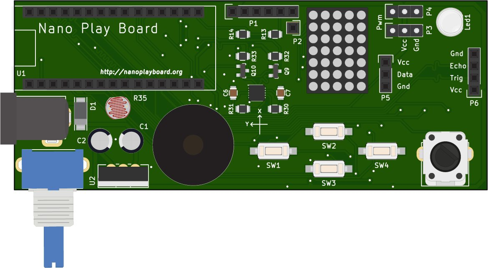

# NanoPlayBoard

Aprende electrónica básica y programación de hardware con NanoPlayBoard.

[Antonio Morales][1] y [José Juan Sánchez][2].

Imagen de portada: [@pighixxx](https://twitter.com/pighixxx).

 Esta obra está bajo una <a rel="license" href="http://creativecommons.org/licenses/by/4.0/">licencia de Creative Commons Reconocimiento 4.0 Internacional</a>.

[1]: https://twitter.com/antonio1010mr
[2]: https://twitter.com/josejuansanchez