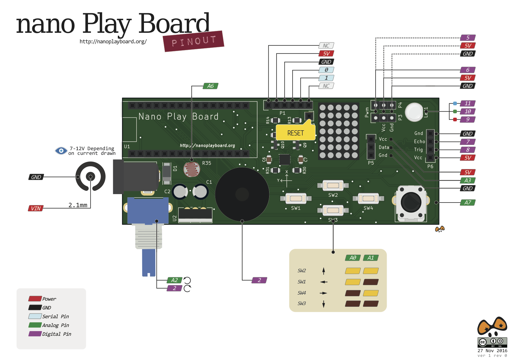

# Pinout

| Referencia | Pin 
| ----------|-------
| Fotoresistencia | A6 |
| Potenciometro | A7 |
| Altavoz piezoelectrónico | D3 |
| Pin Rojo RGB | D9 |
| Pin Verde RGB | D10 |
| Pin Azul RGB | D11 |
| Dato de entrada al registros de desplazamiento | D12 |
| Reloj de carga serie del registros de desplazamiento | D13 |
| Reloj de carga de las salidas de los registros de desplazamiento | D4 |
| Canal A del encoder | D2 |
| Canal B del encoder | A2 |
| Señal PWM del Servo 1 | D5 |
| Señal PWM del Servo 2 | D6 |
| Control del sensor de Temperatura/humedad | A3 |
| Sensor ultrasonidos terminal Trig | D8 |
| Sensor ultrasonidos terminal Echo | D7 |
| Codigo binario estado pulsadores bit0 | A0 |
| Codigo binario estado pulsadores bit1 | A1 |
